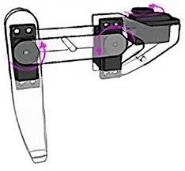

Quadruped Robot — Kinematics from Scratch
This repository is part of my ongoing project to build a 3-DOF quadruped robot from scratch.
Before writing any ROS2 or control code, I wanted to fully understand the mathematics driving the robot — so I built the kinematics layer from first principles: rotation matrices, homogeneous transforms, forward kinematics, and inverse kinematics.

Reference — the leg this work is based on:

Kinematic Chain
base_link
    │
    ├─[hip_abduction, Z]─ coxa_link  (3 cm)
                              │
                    ─[hip_flexion, Y]─ femur_link  (8 cm)
                                           │
                                  ─[knee, Y]─ tibia_link  (10 cm)
                                                  │
                                             foot_link  ← end effector

What is covered
1. Forward Kinematics — forward_kinematics.ipynb

Given joint angles → find where the foot is

Each joint is one homogeneous transformation matrix (4×4).
Chain them together and the last column gives the foot position (x, y, z).
Tfoot=Thip_abduction×Thip_flexion×TkneeT_{foot} = T_{hip\_abduction} \times T_{hip\_flexion} \times T_{knee}Tfoot​=Thip_abduction​×Thip_flexion​×Tknee​
Three different leg configurations visualised:

  

2. Inverse Kinematics — inverse_kinematics.ipynb

Given a desired foot position → find the joint angles

Solved analytically in 3 steps:
StepFormulaSolves1θ₁ = atan2(y, x)Hip abduction — which direction the leg points2d = √(r² + h²)Project to 2D sagittal plane3θ₃ = arccos((d²−L₂²−L₃²) / 2L₂L₃)Knee angle via cosine rule4θ₂ = atan2(−h, r) − atan2(L₃sinθ₃, L₂+L₃cosθ₃)Hip flexion
IK output verified by feeding results back into FK — error < 1e-6 on all test cases.

  

3. URDF — urdf/leg.urdf
Standard ROS2-compatible URDF with proper joint limits, inertial properties, and Gazebo colour tags. Ready to drop into a ROS2 workspace.
Load in Gazebo:
bashgz sdf -p urdf/leg.urdf > leg.sdf
gz sim leg.sdf -r

Repository Structure
quadruped-kinematics/
├── forward_kinematics.ipynb
├── inverse_kinematics.ipynb
├── urdf/
│   └── leg.urdf
├── images/
│   ├── leg_reference.jpeg
│   ├── forward_kinematics.png
│   └── inverse_kinematics.png
└── requirements.txt

Run the notebooks
bashpip install numpy matplotlib
jupyter notebook

What comes next
This kinematics foundation feeds directly into the next stage of the project:
Kinematics (this repo)
        ↓
ROS2 + Gazebo simulation  ←  next repo
        ↓
Gait planning (trot, walk)
        ↓
Reinforcement learning for locomotion  ←  thesis project

Background
Built as part of my MSc in Computer Science (Future Mobility & Robotics) at Hochschule für angewandtes Management, Munich.
The goal is to build a complete locomotion pipeline — from bare mathematics to a walking physical robot — as both a learning exercise and thesis project.
